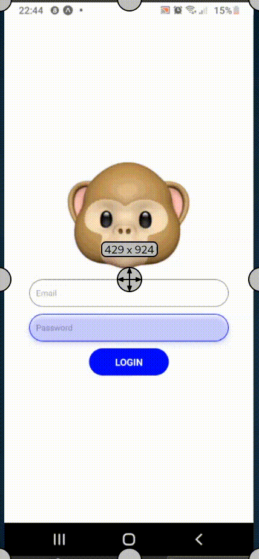

# MonkeySee-MonkeyDo

Discover an interactive React Native Expo Login Form with dynamic animations for engaging user experiences.

## Overview

MonkeySee-MonkeyDo is a React Native Expo project that showcases a dynamic and interactive login form with animations. It provides users with an engaging experience while logging in.

## Features

- Dynamic animations for a visually appealing login form.
- Interactive components for user engagement.
- Smooth transitions between different states of the login form.

## Getting Started

### Installation

To get started with MonkeySee-MonkeyDo, follow these steps:

1. Clone this repository to your local machine:

    ```bash
    git clone https://github.com/Silvokyda/MonkeySee-MonkeyDo
    ```

2. Navigate to the project directory:

    ```bash
    cd MonkeySee-MonkeyDo
    ```

3. Install the necessary dependencies:

    ```bash
    npm install
    ```

### Usage

To run MonkeySee-MonkeyDo on your device, follow these steps:

1. Ensure you have the Expo Go app installed on your device.

2. Start the Expo development server:

    ```bash
    npm start
    ```

3. Use the Expo Go app to scan the QR code displayed in the terminal or Expo DevTools.

4. Experience the MonkeySee-MonkeyDo app on your device!

## OR Scan This To Install


## Demo



## Contributing

We welcome contributions from the community! If you have any ideas for improvements or new features, feel free to open an issue or submit a pull request.

## License

This project is licensed under the [MIT License](LICENSE).